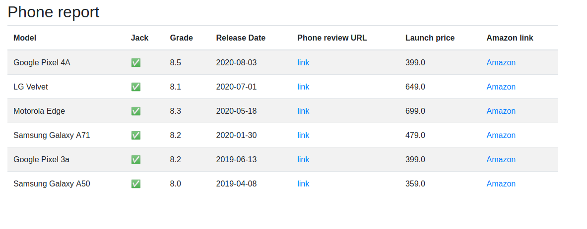

# phone_finder



## Table of Contents

* [About the Project](#about-the-project)
  * [Built With](#built-with)
* [Getting Started](#getting-started)
  * [Prerequisites](#prerequisites)
  * [Installation](#installation)
* [Usage](#usage)

## About The Project

Just a little scraper I built to find the perfect smartphone for me.
Currently it supports scraping only one website. 

### Built With

* [Kotlin](https://kotlinlang.org/)
* [skrape{it}](http://www.skrape.it/)
* [jade4j](https://github.com/neuland/jade4j)

### Usage
 
1. Clone the repo
```sh
git clone https://github.com/giovanniberti/phone_finder
```
2. Build and run the jar
```sh
./gradlew runShadow
```
The program will generate an HTML report in the repo root called `report.html`.
Dynamic filtering is not currently available (and neither planned), but filtering rules can be easily changed in `ReportGenerator.kt::main`